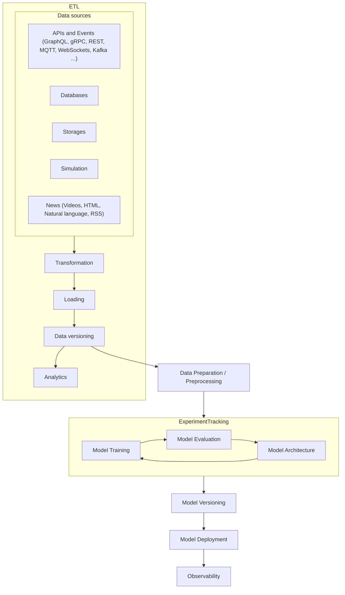

[](https://pyscaffold.org/)
[](https://pypi.org/project/evolufy/)

<!-- These are examples of badges you might also want to add to your README. Update the URLs accordingly.
[](https://cirrus-ci.com/github/<USER>/evolufy)
[](https://evolufy.readthedocs.io/en/stable/)
[](https://coveralls.io/r/<USER>/evolufy)
[](https://anaconda.org/conda-forge/evolufy)
[](https://pepy.tech/project/evolufy)
[](https://twitter.com/evolufy)
-->

# evolufy

> Yet another algotrade engine

Evolufy is a engine designed for the development, deployment, and observability of trading algorithms, featuring options for DataOps/MLOps through open-source tools. It offers simplicity and flexibility, allowing the use of any algorithm, incorporation of any data source, and ensuring easy self-hosting without the need for TripleO (OpenStack on OpenStack on OpenStack) issue.



We have integrated a suite of DataOps to deliver production-ready features for trading:
## Infrastructure
* Use conda, micrombamba and virtual environment to create a rapid prototype.
* Environment-agnostic.
* You likely need a database, a straightforward method for creating dashboards and reports from various data sources, and an easy way to manipulate your data as spreadsheets in your own infrastructure. For these purposes, we provide you with the ```workspace``` Git submodule which includes Supabase, Metabase, MLFlow, Baserow and other useful containers.

## Workflow Orchestration
* [Dagster](https://dagster.io/) is an open-source data orchestrator that defines assets through software. It's designed to facilitate the easy creation of data pipelines locally, and it also offers straightforward deployment on Kubernetes.
This makes it a versatile tool for managing data workflows, particularly in environments where both local development and scalable deployment are important.
* Strategies can be formulated using a configuration file (Domain-Specific Language) or directly in Python.
* TODO: Drag & Drop Orchestration with approval mechanisms, chat creator and model selection 
* TODO: dbt

## Asset Tracking and Model Metadata Management Tools
* Experiment tracking and lifecycle management with [MLFlow](https://mlflow.org/).
* Data Version Control with [DVC](https://dvc.org/).
* Collaborate and reproduce your findings.

## Datasets and Pretrained Machine Learning models
We provide two types of datasets and pretrained models: one hosted on [Zenodo](https://zenodo.org/) for research purposes, which offers datasets with DOIs, and another on [DagsHub](https://dagshub.com/sanchezcarlosjr/evolufy), featuring datasets compatible with DVC and MLflow to ensure rapid learning. Also, we save a backup on HuggingFace until we will be able to do so.


## Experimentation
* Employ time series analysis.
* Optimize Modern Portfolio Theory with different algorithms.
* Out-of-box different investing strategies such as Value Investing.
* Transparent hyperparameter optimization.
* Quantopian libraries instead of ad hoc libraries.
## Testing
* Analyze your strategies with backtesting and traditional machine learning metrics.
* Utilize typical strategies or build on top of them.
* Useful notebooks, streamlit, and CLI.
## Deployment, Serving and Interoperability
* Transparent Model Selection
* Utilize Gradio, MLFlow, or FastAPI to build microservices based on your models, or deploy them on your own infrastructure using ONNX by a Model Registry.
* Deploy on some cluster as Hugging Face or Kubernetes.
* Employ Dagster to develop workflows in your cluster or locally, integrating your data sources and preferred brokers.
## Observability
* TODO: Model Performance Monitoring
## Analytics
* TODO: 
## Self-hosted web
* We recommend using Cloudflare Tunnels for self-hosting your web applications.

## Installation

In order to set up the necessary environment:

1. review and uncomment what you need in `environment.yml` and create an environment `evolufy` with the help of [conda]:
   ```
   conda env create -f environment.yml
   ```
2. activate the new environment with:
   ```
   conda activate evolufy
   ```

> **_NOTE:_**  The conda environment will have evolufy installed in editable mode.
> Some changes, e.g. in `setup.cfg`, might require you to run `pip install -e .` again.


Optional and needed only once after `git clone`:

3. install several [pre-commit] git hooks with:
   ```bash
   pre-commit install
   # You might also want to run `pre-commit autoupdate`
   ```
   and checkout the configuration under `.pre-commit-config.yaml`.
   The `-n, --no-verify` flag of `git commit` can be used to deactivate pre-commit hooks temporarily.

4. install [nbstripout] git hooks to remove the output cells of committed notebooks with:
   ```bash
   nbstripout --install --attributes notebooks/.gitattributes
   ```
   This is useful to avoid large diffs due to plots in your notebooks.
   A simple `nbstripout --uninstall` will revert these changes.

   
Then take a look into the `scripts` and `notebooks` folders.


## Best practices
These practices are not mandatory when working with Evolufy, but they can enhance your user experience and improve the performance of your strategy.
1. You should convert your _structured data_ into a standardized format, such as Apache Parquet, which is optimized for OLAP (Online Analytical Processing) rather than OLTP (Online Transaction Processing). We advise you that serializing your data using Pickle is not a standard practice, but it is a fast way to create prototypes.
2. The file system should act as the Single Source of Truth because it minimizes the risk of network errors and lowers latency in operations. However, replicating data in other storage systems as needed is advisable. DVC, an open-source tool, facilitates this process and also helps manage metrics and models with MLFlow. Additionally, you can access data from other sources using Dagster's IO Manager, which transparently extracts and saves data, or adopt a more advanced methods using Filesystem in Userspace or HDFS. Finally, libraries such as Pandas and SQLAlchemy offer methods to accomplish these tasks, but they are less transparent and consequently add more boilerplate code.
3. Software defines assets instead of a series of operations. 
4. Prefer using ready-to-go containers and MLFlow for tracking over writing your own software with Streamlit. For instance, if you want to observe the market in real-time, consider using Grafana.   
5. Experiment with notebooks, but ensure they remain usable for integration with Dagster. 

## Dependency Management & Reproducibility

1. Always keep your abstract (unpinned) dependencies updated in `environment.yml` and eventually
   in `setup.cfg` if you want to ship and install your package via `pip` later on.
2. Create concrete dependencies as `environment.lock.yml` for the exact reproduction of your
   environment with:
   ```bash
   conda env export -n evolufy -f environment.lock.yml
   ```
   For multi-OS development, consider using `--no-builds` during the export.
3. Update your current environment with respect to a new `environment.lock.yml` using:
   ```bash
   conda env update -f environment.lock.yml --prune
   ```
## Project Organization

```
├── AUTHORS.md              <- List of developers and maintainers.
├── CHANGELOG.md            <- Changelog to keep track of new features and fixes.
├── CONTRIBUTING.md         <- Guidelines for contributing to this project.
├── Dockerfile              <- Build a docker container with `docker build .`.
├── LICENSE.txt             <- License as chosen on the command-line.
├── README.md               <- The top-level README for developers.
├── configs                 <- Directory for configurations of model & application.
├── data
│   ├── external            <- Data from third party sources.
│   ├── interim             <- Intermediate data that has been transformed.
│   ├── processed           <- The final, canonical data sets for modeling.
│   └── raw                 <- The original, immutable data dump.
├── docs                    <- Directory for Sphinx documentation in rst or md.
├── environment.yml         <- The conda environment file for reproducibility.
├── models                  <- Trained and serialized models, model predictions,
│                              or model summaries.
├── notebooks               <- Jupyter notebooks. Naming convention is a number (for
│                              ordering), the creator's initials and a description,
│                              e.g. `1.0-fw-initial-data-exploration`.
├── pyproject.toml          <- Build configuration. Don't change! Use `pip install -e .`
│                              to install for development or to build `tox -e build`.
├── references              <- Data dictionaries, manuals, and all other materials.
├── reports                 <- Generated analysis as HTML, PDF, LaTeX, etc.
│   └── figures             <- Generated plots and figures for reports.
├── scripts                 <- Analysis and production scripts which import the
│                              actual PYTHON_PKG, e.g. train_model.
├── setup.cfg               <- Declarative configuration of your project.
├── setup.py                <- [DEPRECATED] Use `python setup.py develop` to install for
│                              development or `python setup.py bdist_wheel` to build.
├── src
│   └── evolufy             <- Actual Python package where the main functionality goes.
├── tests                   <- Unit tests which can be run with `pytest`.
├── .coveragerc             <- Configuration for coverage reports of unit tests.
├── .isort.cfg              <- Configuration for git hook that sorts imports.
└── .pre-commit-config.yaml <- Configuration of pre-commit git hooks.
```

<!-- pyscaffold-notes -->

# Alternatives
Numer.ai: As a crowd-sourced hedge fund, Numer.ai does not typically offer self-hosting capabilities. It operates on a unique model where users submit predictive models to the platform.

QuantConnect: This platform is open-source and allows users to run their algorithms on their own infrastructure, providing an opportunity for self-hosting.

AlgoTrader: AlgoTrader is designed for institutional and professional traders and offers a software solution that can be self-hosted.

TradingView: Primarily a web-based platform for charting and analysis, TradingView does not offer a traditional self-hosting option.

Backtrader: Being an open-source Python framework, Backtrader can be run on the user's own machine or server, allowing for self-hosting.

Quantiacs: This platform primarily focuses on providing a marketplace for trading algorithms and does not typically offer self-hosting capabilities.

Empirica: As a white-label platform, Empirica might offer some level of customization and self-hosting, depending on the specific requirements and arrangements.

Catalyst: As a Python library, Catalyst can be run locally, allowing users to self-host their trading algorithms.

TradingSim: This is a virtual trading platform focused on simulation and practice, and does not typically offer self-hosting.

Quantopian

https://www.quantrocket.com/

https://jesse.trade/

https://www.lean.io/cli/

## Note

This project has been set up using [PyScaffold] 4.5 and the [dsproject extension] 0.0.post158+g5fb5c40.d20231203.

[conda]: https://docs.conda.io/
[pre-commit]: https://pre-commit.com/
[Jupyter]: https://jupyter.org/
[nbstripout]: https://github.com/kynan/nbstripout
[Google style]: http://google.github.io/styleguide/pyguide.html#38-comments-and-docstrings
[PyScaffold]: https://pyscaffold.org/
[dsproject extension]: https://github.com/pyscaffold/pyscaffoldext-dsproject
