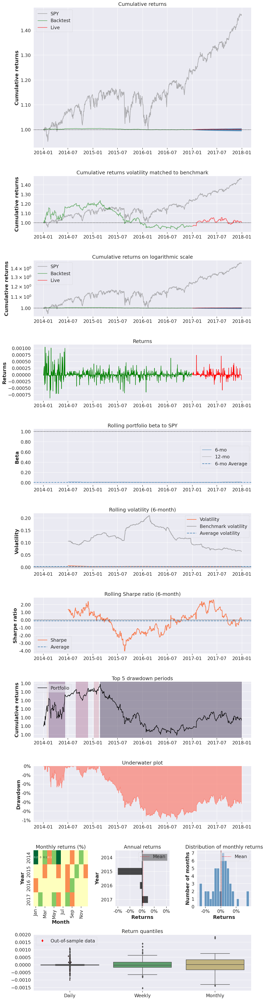
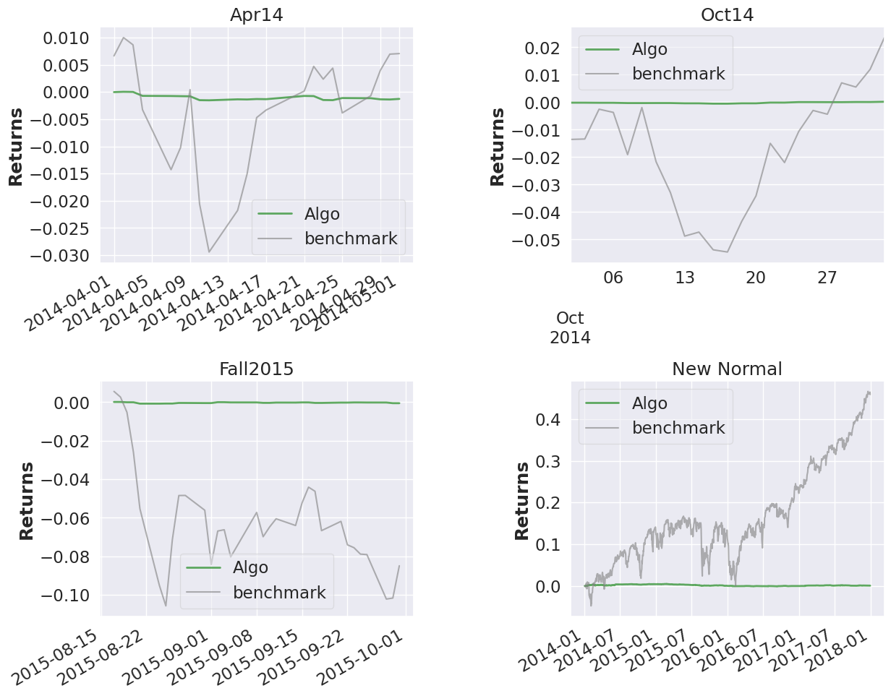
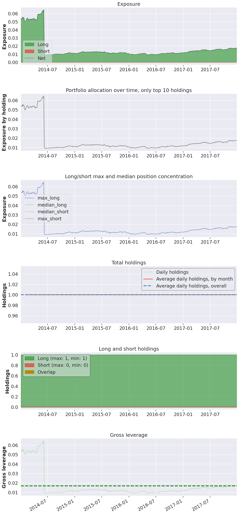
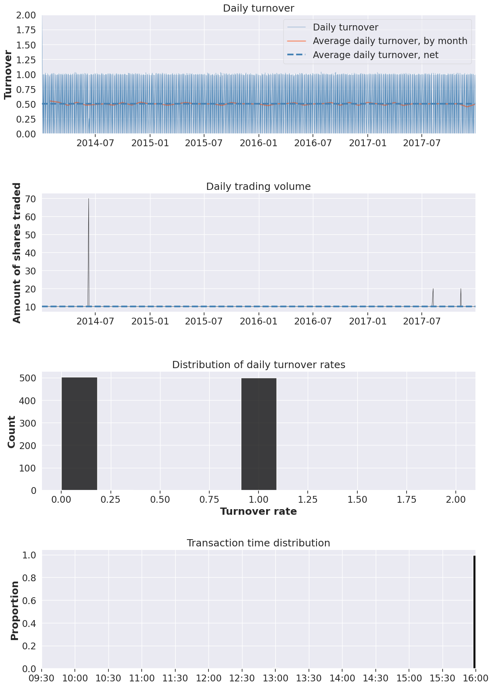
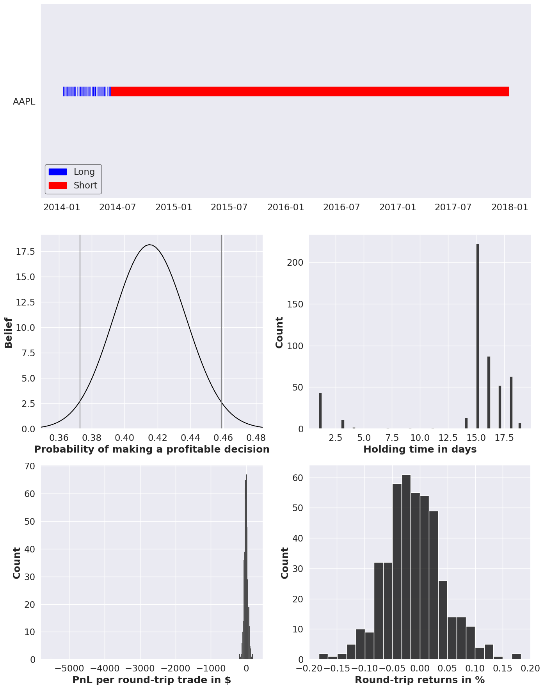

#### Experiment [e99649cf-5b2a-4c29-8f5a-a73e7fff160c](https://dagshub.com/sanchezcarlosjr/evolufy/src/main/data/processed/e99649cf-5b2a-4c29-8f5a-a73e7fff160c).

#### Full tear sheet

Live testing was started at 2017-01-01 where SPY was our benchmark and expected return of the market. Using this strategy, the capital at the end of the investment period were 66.15.

<table border="1" class="dataframe">
  <thead>
    <tr style="text-align: right;"><th>Start date</th><td colspan=4>2014-01-02</td></tr>
    <tr style="text-align: right;"><th>End date</th><td colspan=4>2017-12-29</td></tr>
    <tr style="text-align: right;"><th>In-sample months</th><td colspan=4>36</td></tr>
    <tr style="text-align: right;"><th>Out-of-sample months</th><td colspan=4>11</td></tr>
    <tr style="text-align: right;">
      <th></th>
      <th>In-sample</th>
      <th>Out-of-sample</th>
      <th>All</th>
    </tr>
  </thead>
  <tbody>
    <tr>
      <th>Annual return</th>
      <td>-0.01%</td>
      <td>0.096%</td>
      <td>0.017%</td>
    </tr>
    <tr>
      <th>Cumulative returns</th>
      <td>-0.029%</td>
      <td>0.095%</td>
      <td>0.066%</td>
    </tr>
    <tr>
      <th>Annual volatility</th>
      <td>0.277%</td>
      <td>0.194%</td>
      <td>0.259%</td>
    </tr>
    <tr>
      <th>Sharpe ratio</th>
      <td>-0.03</td>
      <td>0.49</td>
      <td>0.07</td>
    </tr>
    <tr>
      <th>Calmar ratio</th>
      <td>-0.02</td>
      <td>0.64</td>
      <td>0.03</td>
    </tr>
    <tr>
      <th>Stability</th>
      <td>0.54</td>
      <td>0.06</td>
      <td>0.37</td>
    </tr>
    <tr>
      <th>Max drawdown</th>
      <td>-0.594%</td>
      <td>-0.149%</td>
      <td>-0.594%</td>
    </tr>
    <tr>
      <th>Omega ratio</th>
      <td>0.99</td>
      <td>1.13</td>
      <td>1.02</td>
    </tr>
    <tr>
      <th>Sortino ratio</th>
      <td>-0.05</td>
      <td>0.86</td>
      <td>0.10</td>
    </tr>
    <tr>
      <th>Skew</th>
      <td>0.86</td>
      <td>1.54</td>
      <td>0.94</td>
    </tr>
    <tr>
      <th>Kurtosis</th>
      <td>10.90</td>
      <td>11.58</td>
      <td>11.83</td>
    </tr>
    <tr>
      <th>Tail ratio</th>
      <td>0.92</td>
      <td>1.58</td>
      <td>1.02</td>
    </tr>
    <tr>
      <th>Daily value at risk</th>
      <td>-0.035%</td>
      <td>-0.024%</td>
      <td>-0.033%</td>
    </tr>
    <tr>
      <th>Gross leverage</th>
      <td>0.02</td>
      <td>0.02</td>
      <td>0.02</td>
    </tr>
    <tr>
      <th>Daily turnover</th>
      <td>50.15%</td>
      <td>49.902%</td>
      <td>49.989%</td>
    </tr>
    <tr>
      <th>Alpha</th>
      <td>-0.00</td>
      <td>-0.00</td>
      <td>-0.00</td>
    </tr>
    <tr>
      <th>Beta</th>
      <td>0.01</td>
      <td>0.01</td>
      <td>0.01</td>
    </tr>
  </tbody>
</table>

<table border="1" class="dataframe">
  <thead>
    <tr style="text-align: right;">
      <th>Worst drawdown periods</th>
      <th>Net drawdown in %</th>
      <th>Peak date</th>
      <th>Valley date</th>
      <th>Recovery date</th>
      <th>Duration</th>
    </tr>
  </thead>
  <tbody>
    <tr>
      <th>0</th>
      <td>0.59</td>
      <td>2015-02-23</td>
      <td>2016-09-09</td>
      <td>NaT</td>
      <td>NaN</td>
    </tr>
    <tr>
      <th>1</th>
      <td>0.24</td>
      <td>2014-02-10</td>
      <td>2014-05-16</td>
      <td>2014-06-09</td>
      <td>86</td>
    </tr>
    <tr>
      <th>2</th>
      <td>0.13</td>
      <td>2014-08-29</td>
      <td>2014-10-16</td>
      <td>2014-11-24</td>
      <td>62</td>
    </tr>
    <tr>
      <th>3</th>
      <td>0.07</td>
      <td>2015-01-08</td>
      <td>2015-01-28</td>
      <td>2015-02-12</td>
      <td>26</td>
    </tr>
    <tr>
      <th>4</th>
      <td>0.06</td>
      <td>2014-01-27</td>
      <td>2014-01-30</td>
      <td>2014-02-04</td>
      <td>7</td>
    </tr>
  </tbody>
</table>

<table border="1" class="dataframe">
  <thead>
    <tr style="text-align: right;">
      <th>Stress Events</th>
      <th>mean</th>
      <th>min</th>
      <th>max</th>
    </tr>
  </thead>
  <tbody>
    <tr>
      <th>Apr14</th>
      <td>-0.01%</td>
      <td>-0.07%</td>
      <td>0.06%</td>
    </tr>
    <tr>
      <th>Oct14</th>
      <td>0.00%</td>
      <td>-0.02%</td>
      <td>0.03%</td>
    </tr>
    <tr>
      <th>Fall2015</th>
      <td>-0.00%</td>
      <td>-0.07%</td>
      <td>0.05%</td>
    </tr>
    <tr>
      <th>New Normal</th>
      <td>0.00%</td>
      <td>-0.09%</td>
      <td>0.10%</td>
    </tr>
  </tbody>
</table>

<table border="1" class="dataframe">
  <thead>
    <tr style="text-align: right;">
      <th>Summary stats</th>
      <th>All trades</th>
      <th>Short trades</th>
      <th>Long trades</th>
    </tr>
  </thead>
  <tbody>
    <tr>
      <th>Total number of round_trips</th>
      <td>503.00</td>
      <td>449.00</td>
      <td>54.00</td>
    </tr>
    <tr>
      <th>Percent profitable</th>
      <td>0.42</td>
      <td>0.40</td>
      <td>0.54</td>
    </tr>
    <tr>
      <th>Winning round_trips</th>
      <td>209.00</td>
      <td>180.00</td>
      <td>29.00</td>
    </tr>
    <tr>
      <th>Losing round_trips</th>
      <td>294.00</td>
      <td>269.00</td>
      <td>25.00</td>
    </tr>
    <tr>
      <th>Even round_trips</th>
      <td>0.00</td>
      <td>0.00</td>
      <td>0.00</td>
    </tr>
  </tbody>
</table>

<table border="1" class="dataframe">
  <thead>
    <tr style="text-align: right;">
      <th>PnL stats</th>
      <th>All trades</th>
      <th>Short trades</th>
      <th>Long trades</th>
    </tr>
  </thead>
  <tbody>
    <tr>
      <th>Total profit</th>
      <td>$-10296.84</td>
      <td>$-5043.46</td>
      <td>$-5253.38</td>
    </tr>
    <tr>
      <th>Gross profit</th>
      <td>$8305.53</td>
      <td>$7124.75</td>
      <td>$1180.78</td>
    </tr>
    <tr>
      <th>Gross loss</th>
      <td>$-18602.37</td>
      <td>$-12168.21</td>
      <td>$-6434.16</td>
    </tr>
    <tr>
      <th>Profit factor</th>
      <td>$0.45</td>
      <td>$0.59</td>
      <td>$0.18</td>
    </tr>
    <tr>
      <th>Avg. trade net profit</th>
      <td>$-20.47</td>
      <td>$-11.23</td>
      <td>$-97.28</td>
    </tr>
    <tr>
      <th>Avg. winning trade</th>
      <td>$39.74</td>
      <td>$39.58</td>
      <td>$40.72</td>
    </tr>
    <tr>
      <th>Avg. losing trade</th>
      <td>$-63.27</td>
      <td>$-45.23</td>
      <td>$-257.37</td>
    </tr>
    <tr>
      <th>Ratio Avg. Win:Avg. Loss</th>
      <td>$0.63</td>
      <td>$0.88</td>
      <td>$0.16</td>
    </tr>
    <tr>
      <th>Largest winning trade</th>
      <td>$182.57</td>
      <td>$182.57</td>
      <td>$101.19</td>
    </tr>
    <tr>
      <th>Largest losing trade</th>
      <td>$-5522.40</td>
      <td>$-189.46</td>
      <td>$-5522.40</td>
    </tr>
  </tbody>
</table>

<table border="1" class="dataframe">
  <thead>
    <tr style="text-align: right;">
      <th>Duration stats</th>
      <th>All trades</th>
      <th>Short trades</th>
      <th>Long trades</th>
    </tr>
  </thead>
  <tbody>
    <tr>
      <th>Avg duration</th>
      <td>14 days 06:55:06.560636183</td>
      <td>15 days 19:53:03.073496659</td>
      <td>1 days 11:33:20</td>
    </tr>
    <tr>
      <th>Median duration</th>
      <td>15 days 00:00:00</td>
      <td>15 days 01:00:00</td>
      <td>1 days 00:00:00</td>
    </tr>
    <tr>
      <th>Longest duration</th>
      <td>19 days 00:00:00</td>
      <td>19 days 00:00:00</td>
      <td>4 days 00:00:00</td>
    </tr>
    <tr>
      <th>Shortest duration</th>
      <td>1 days 00:00:00</td>
      <td>1 days 00:00:00</td>
      <td>1 days 00:00:00</td>
    </tr>
  </tbody>
</table>

<table border="1" class="dataframe">
  <thead>
    <tr style="text-align: right;">
      <th>Return stats</th>
      <th>All trades</th>
      <th>Short trades</th>
      <th>Long trades</th>
    </tr>
  </thead>
  <tbody>
    <tr>
      <th>Avg returns all round_trips</th>
      <td>-0.01%</td>
      <td>-0.01%</td>
      <td>NaN</td>
    </tr>
    <tr>
      <th>Avg returns winning</th>
      <td>0.04%</td>
      <td>0.04%</td>
      <td>NaN</td>
    </tr>
    <tr>
      <th>Avg returns losing</th>
      <td>-0.04%</td>
      <td>-0.04%</td>
      <td>NaN</td>
    </tr>
    <tr>
      <th>Median returns all round_trips</th>
      <td>-0.01%</td>
      <td>-0.01%</td>
      <td>NaN</td>
    </tr>
    <tr>
      <th>Median returns winning</th>
      <td>0.03%</td>
      <td>0.03%</td>
      <td>NaN</td>
    </tr>
    <tr>
      <th>Median returns losing</th>
      <td>-0.04%</td>
      <td>-0.04%</td>
      <td>NaN</td>
    </tr>
    <tr>
      <th>Largest winning trade</th>
      <td>0.18%</td>
      <td>0.18%</td>
      <td>NaN</td>
    </tr>
    <tr>
      <th>Largest losing trade</th>
      <td>-0.18%</td>
      <td>-0.18%</td>
      <td>NaN</td>
    </tr>
  </tbody>
</table>

<table border="1" class="dataframe">
  <thead>
    <tr style="text-align: right;">
      <th>Symbol stats</th>
      <th>AAPL</th>
    </tr>
  </thead>
  <tbody>
    <tr>
      <th>Avg returns all round_trips</th>
      <td>-0.01%</td>
    </tr>
    <tr>
      <th>Avg returns winning</th>
      <td>0.04%</td>
    </tr>
    <tr>
      <th>Avg returns losing</th>
      <td>-0.04%</td>
    </tr>
    <tr>
      <th>Median returns all round_trips</th>
      <td>-0.01%</td>
    </tr>
    <tr>
      <th>Median returns winning</th>
      <td>0.03%</td>
    </tr>
    <tr>
      <th>Median returns losing</th>
      <td>-0.04%</td>
    </tr>
    <tr>
      <th>Largest winning trade</th>
      <td>0.18%</td>
    </tr>
    <tr>
      <th>Largest losing trade</th>
      <td>-0.18%</td>
    </tr>
  </tbody>
</table>

<table border="1" class="dataframe">
  <thead>
    <tr style="text-align: right;">
      <th>Profitability (PnL / PnL total) per name</th>
      <th></th>
    </tr>
    <tr>
      <th>symbol</th>
      <th></th>
    </tr>
  </thead>
  <tbody>
    <tr>
      <th>AAPL</th>
      <td>100.00%</td>
    </tr>
  </tbody>
</table>

    

    

    

    

    

    

    

    

    

    

