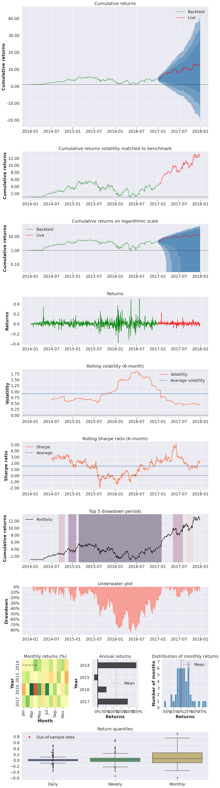
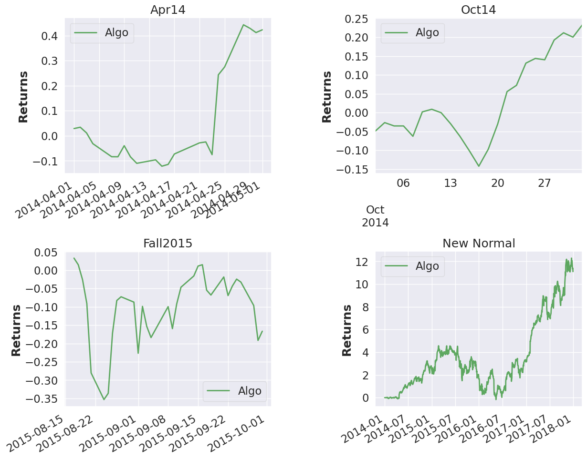
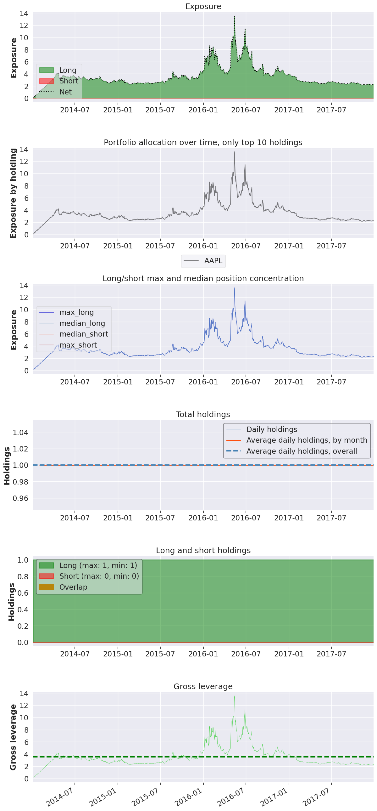
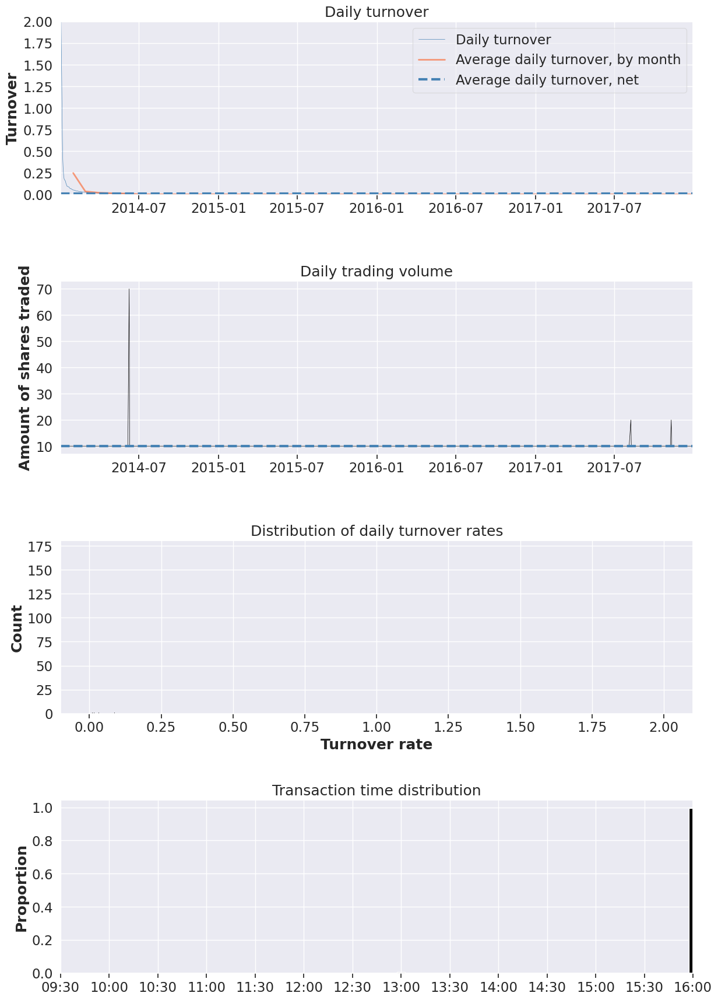

# Full Tear Sheet

#### Experiment fba7637e-a410-4dda-9a6e-4909f9e03574
Live testing was started at 2017-01-01.

<table border="1" class="dataframe">
  <thead>
    <tr style="text-align: right;"><th>Start date</th><td colspan=4>2014-01-02</td></tr>
    <tr style="text-align: right;"><th>End date</th><td colspan=4>2017-12-29</td></tr>
    <tr style="text-align: right;"><th>In-sample months</th><td colspan=4>36</td></tr>
    <tr style="text-align: right;"><th>Out-of-sample months</th><td colspan=4>11</td></tr>
    <tr style="text-align: right;">
      <th></th>
      <th>In-sample</th>
      <th>Out-of-sample</th>
      <th>All</th>
    </tr>
  </thead>
  <tbody>
    <tr>
      <th>Annual return</th>
      <td>60.531%</td>
      <td>193.675%</td>
      <td>86.612%</td>
    </tr>
    <tr>
      <th>Cumulative returns</th>
      <td>313.688%</td>
      <td>192.422%</td>
      <td>1109.716%</td>
    </tr>
    <tr>
      <th>Annual volatility</th>
      <td>106.74%</td>
      <td>46.777%</td>
      <td>95.366%</td>
    </tr>
    <tr>
      <th>Sharpe ratio</th>
      <td>0.96</td>
      <td>2.53</td>
      <td>1.12</td>
    </tr>
    <tr>
      <th>Calmar ratio</th>
      <td>0.71</td>
      <td>9.24</td>
      <td>1.02</td>
    </tr>
    <tr>
      <th>Stability</th>
      <td>0.12</td>
      <td>0.81</td>
      <td>0.52</td>
    </tr>
    <tr>
      <th>Max drawdown</th>
      <td>-85.112%</td>
      <td>-20.956%</td>
      <td>-85.112%</td>
    </tr>
    <tr>
      <th>Omega ratio</th>
      <td>1.22</td>
      <td>1.62</td>
      <td>1.26</td>
    </tr>
    <tr>
      <th>Sortino ratio</th>
      <td>1.53</td>
      <td>4.60</td>
      <td>1.79</td>
    </tr>
    <tr>
      <th>Skew</th>
      <td>1.07</td>
      <td>1.49</td>
      <td>1.17</td>
    </tr>
    <tr>
      <th>Kurtosis</th>
      <td>12.24</td>
      <td>10.85</td>
      <td>15.13</td>
    </tr>
    <tr>
      <th>Tail ratio</th>
      <td>1.13</td>
      <td>1.19</td>
      <td>1.07</td>
    </tr>
    <tr>
      <th>Daily value at risk</th>
      <td>-13.039%</td>
      <td>-5.423%</td>
      <td>-11.591%</td>
    </tr>
    <tr>
      <th>Gross leverage</th>
      <td>3.83</td>
      <td>2.59</td>
      <td>3.52</td>
    </tr>
    <tr>
      <th>Daily turnover</th>
      <td>0.963%</td>
      <td>0.066%</td>
      <td>0.739%</td>
    </tr>
  </tbody>
</table>

<table border="1" class="dataframe">
  <thead>
    <tr style="text-align: right;">
      <th>Worst drawdown periods</th>
      <th>Net drawdown in %</th>
      <th>Peak date</th>
      <th>Valley date</th>
      <th>Recovery date</th>
      <th>Duration</th>
    </tr>
  </thead>
  <tbody>
    <tr>
      <th>0</th>
      <td>85.11</td>
      <td>2015-02-23</td>
      <td>2016-05-12</td>
      <td>2017-02-01</td>
      <td>508</td>
    </tr>
    <tr>
      <th>1</th>
      <td>27.35</td>
      <td>2014-11-26</td>
      <td>2015-01-16</td>
      <td>2015-01-29</td>
      <td>47</td>
    </tr>
    <tr>
      <th>2</th>
      <td>20.96</td>
      <td>2017-05-12</td>
      <td>2017-06-16</td>
      <td>2017-08-02</td>
      <td>59</td>
    </tr>
    <tr>
      <th>3</th>
      <td>20.43</td>
      <td>2014-09-02</td>
      <td>2014-10-16</td>
      <td>2014-10-23</td>
      <td>38</td>
    </tr>
    <tr>
      <th>4</th>
      <td>18.97</td>
      <td>2017-09-01</td>
      <td>2017-09-25</td>
      <td>2017-10-30</td>
      <td>42</td>
    </tr>
  </tbody>
</table>

<table border="1" class="dataframe">
  <thead>
    <tr style="text-align: right;">
      <th>Stress Events</th>
      <th>mean</th>
      <th>min</th>
      <th>max</th>
    </tr>
  </thead>
  <tbody>
    <tr>
      <th>Apr14</th>
      <td>1.91%</td>
      <td>-5.38%</td>
      <td>34.49%</td>
    </tr>
    <tr>
      <th>Oct14</th>
      <td>0.99%</td>
      <td>-4.93%</td>
      <td>8.92%</td>
    </tr>
    <tr>
      <th>Fall2015</th>
      <td>-0.19%</td>
      <td>-20.85%</td>
      <td>24.73%</td>
    </tr>
    <tr>
      <th>New Normal</th>
      <td>0.42%</td>
      <td>-37.68%</td>
      <td>50.33%</td>
    </tr>
  </tbody>
</table>

<table border="1" class="dataframe">
  <thead>
    <tr style="text-align: right;">
      <th>Top 10 long positions of all time</th>
      <th>max</th>
    </tr>
    <tr>
      <th>sid</th>
      <th></th>
    </tr>
  </thead>
  <tbody>
    <tr>
      <th>AAPL</th>
      <td>1354.10%</td>
    </tr>
  </tbody>
</table>

<table border="1" class="dataframe">
  <thead>
    <tr style="text-align: right;">
      <th>Top 10 short positions of all time</th>
      <th>max</th>
    </tr>
    <tr>
      <th>sid</th>
      <th></th>
    </tr>
  </thead>
  <tbody>
  </tbody>
</table>

<table border="1" class="dataframe">
  <thead>
    <tr style="text-align: right;">
      <th>Top 10 positions of all time</th>
      <th>max</th>
    </tr>
    <tr>
      <th>sid</th>
      <th></th>
    </tr>
  </thead>
  <tbody>
    <tr>
      <th>AAPL</th>
      <td>1354.10%</td>
    </tr>
  </tbody>
</table>

    

    

    

    

    

    

    

    

