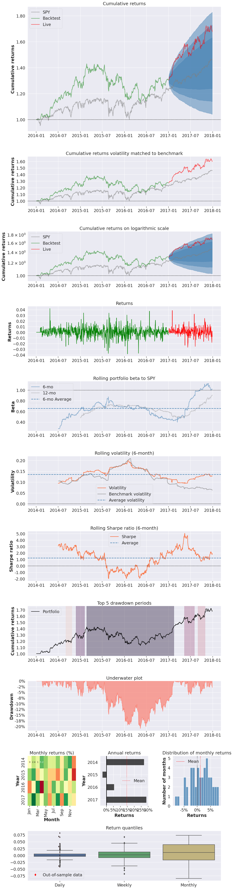
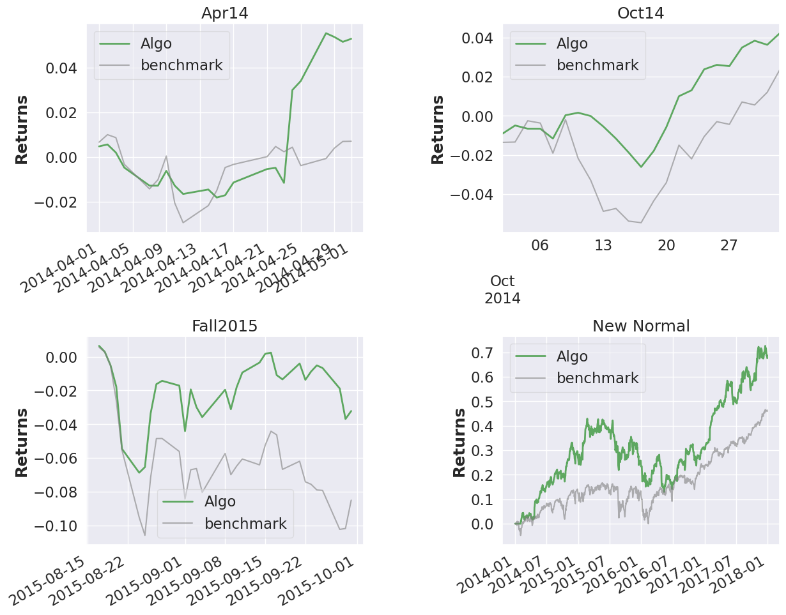
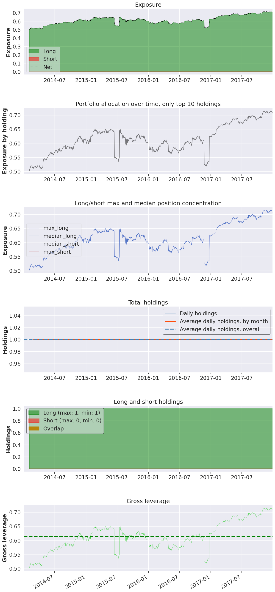
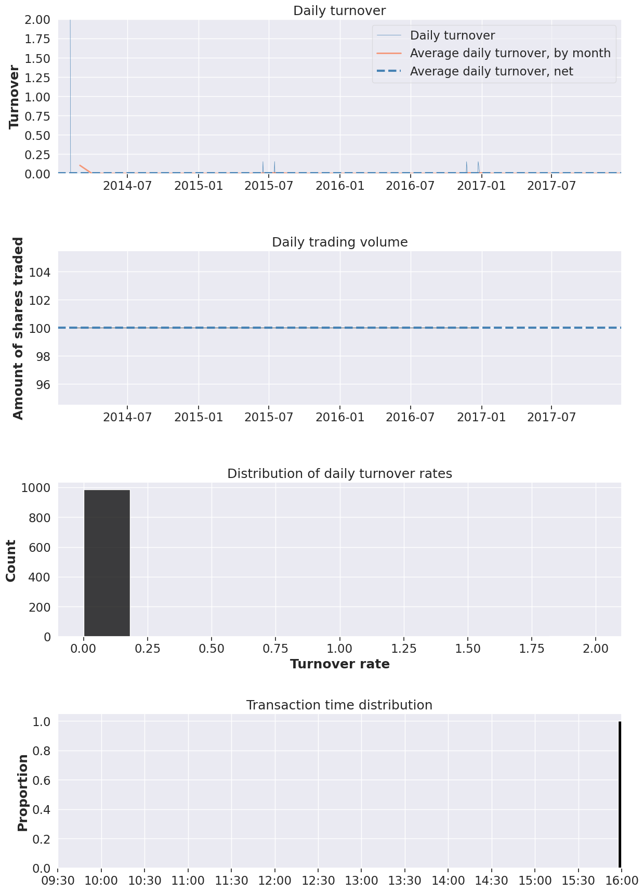

# Experiment [95438bfd-843c-42fb-9b51-bccb7dbfb54f](https://dagshub.com/sanchezcarlosjr/evolufy/src/main/data/processed/95438bfd-843c-42fb-9b51-bccb7dbfb54f).

#### Full tear sheet

Live testing was started at 2017-01-01 where SPY was our benchmark and expected return of the market. Using this strategy, the capital at the end of the investment period were -50822.77.

The rebalance strategy is buying shares at the start of year and selling at the end of year. We din't neither valuate the assets nor optimize the selection.

<table border="1" class="dataframe">
  <thead>
    <tr style="text-align: right;"><th>Start date</th><td colspan=4>2014-01-02</td></tr>
    <tr style="text-align: right;"><th>End date</th><td colspan=4>2017-12-29</td></tr>
    <tr style="text-align: right;"><th>In-sample months</th><td colspan=4>36</td></tr>
    <tr style="text-align: right;"><th>Out-of-sample months</th><td colspan=4>11</td></tr>
    <tr style="text-align: right;">
      <th></th>
      <th>In-sample</th>
      <th>Out-of-sample</th>
      <th>All</th>
    </tr>
  </thead>
  <tbody>
    <tr>
      <th>Annual return</th>
      <td>9.21%</td>
      <td>28.833%</td>
      <td>13.802%</td>
    </tr>
    <tr>
      <th>Cumulative returns</th>
      <td>30.251%</td>
      <td>28.704%</td>
      <td>67.638%</td>
    </tr>
    <tr>
      <th>Annual volatility</th>
      <td>13.867%</td>
      <td>12.095%</td>
      <td>13.449%</td>
    </tr>
    <tr>
      <th>Sharpe ratio</th>
      <td>0.70</td>
      <td>2.16</td>
      <td>1.03</td>
    </tr>
    <tr>
      <th>Calmar ratio</th>
      <td>0.44</td>
      <td>4.72</td>
      <td>0.66</td>
    </tr>
    <tr>
      <th>Stability</th>
      <td>0.20</td>
      <td>0.85</td>
      <td>0.60</td>
    </tr>
    <tr>
      <th>Max drawdown</th>
      <td>-20.967%</td>
      <td>-6.11%</td>
      <td>-20.967%</td>
    </tr>
    <tr>
      <th>Omega ratio</th>
      <td>1.13</td>
      <td>1.49</td>
      <td>1.20</td>
    </tr>
    <tr>
      <th>Sortino ratio</th>
      <td>1.03</td>
      <td>3.52</td>
      <td>1.53</td>
    </tr>
    <tr>
      <th>Skew</th>
      <td>-0.03</td>
      <td>0.41</td>
      <td>0.04</td>
    </tr>
    <tr>
      <th>Kurtosis</th>
      <td>3.18</td>
      <td>4.20</td>
      <td>3.44</td>
    </tr>
    <tr>
      <th>Tail ratio</th>
      <td>1.02</td>
      <td>1.25</td>
      <td>1.04</td>
    </tr>
    <tr>
      <th>Daily value at risk</th>
      <td>-1.708%</td>
      <td>-1.42%</td>
      <td>-1.64%</td>
    </tr>
    <tr>
      <th>Gross leverage</th>
      <td>0.59</td>
      <td>0.68</td>
      <td>0.61</td>
    </tr>
    <tr>
      <th>Daily turnover</th>
      <td>0.356%</td>
      <td>nan%</td>
      <td>0.265%</td>
    </tr>
    <tr>
      <th>Alpha</th>
      <td>0.05</td>
      <td>0.10</td>
      <td>0.08</td>
    </tr>
    <tr>
      <th>Beta</th>
      <td>0.61</td>
      <td>0.91</td>
      <td>0.64</td>
    </tr>
  </tbody>
</table>

<table border="1" class="dataframe">
  <thead>
    <tr style="text-align: right;">
      <th>Worst drawdown periods</th>
      <th>Net drawdown in %</th>
      <th>Peak date</th>
      <th>Valley date</th>
      <th>Recovery date</th>
      <th>Duration</th>
    </tr>
  </thead>
  <tbody>
    <tr>
      <th>0</th>
      <td>20.97</td>
      <td>2015-02-23</td>
      <td>2016-05-12</td>
      <td>2017-02-14</td>
      <td>517</td>
    </tr>
    <tr>
      <th>1</th>
      <td>6.84</td>
      <td>2014-11-26</td>
      <td>2015-01-16</td>
      <td>2015-02-04</td>
      <td>51</td>
    </tr>
    <tr>
      <th>2</th>
      <td>6.11</td>
      <td>2017-05-12</td>
      <td>2017-06-16</td>
      <td>2017-08-02</td>
      <td>59</td>
    </tr>
    <tr>
      <th>3</th>
      <td>5.76</td>
      <td>2017-09-01</td>
      <td>2017-09-25</td>
      <td>2017-10-30</td>
      <td>42</td>
    </tr>
    <tr>
      <th>4</th>
      <td>4.03</td>
      <td>2014-09-02</td>
      <td>2014-10-16</td>
      <td>2014-10-23</td>
      <td>38</td>
    </tr>
  </tbody>
</table>

<table border="1" class="dataframe">
  <thead>
    <tr style="text-align: right;">
      <th>Stress Events</th>
      <th>mean</th>
      <th>min</th>
      <th>max</th>
    </tr>
  </thead>
  <tbody>
    <tr>
      <th>Apr14</th>
      <td>0.24%</td>
      <td>-0.81%</td>
      <td>4.21%</td>
    </tr>
    <tr>
      <th>Oct14</th>
      <td>0.18%</td>
      <td>-0.91%</td>
      <td>1.59%</td>
    </tr>
    <tr>
      <th>Fall2015</th>
      <td>-0.09%</td>
      <td>-3.75%</td>
      <td>3.40%</td>
    </tr>
    <tr>
      <th>New Normal</th>
      <td>0.05%</td>
      <td>-3.84%</td>
      <td>4.21%</td>
    </tr>
  </tbody>
</table>

    

    

    

    

    

    

    

    

